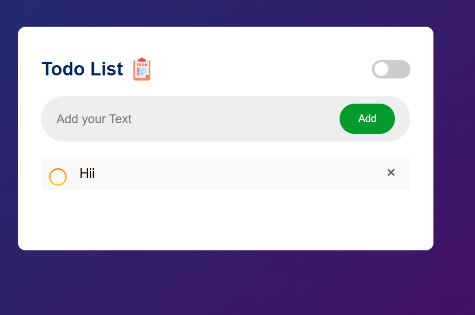

# To-Do-List-App
This is a Todo List App using HTML,CSS and Java Script.

# 📝 Todo List Web App

A simple and responsive Todo List application built using **HTML**, **CSS**, and **JavaScript**. It supports adding, editing, deleting, checking off tasks, drag-and-drop reordering, dark mode toggle, and data persistence using `localStorage`.

## 🌟 Features

- ✅ Add, check, and delete tasks
- ✏️ Double-click to edit a task
- 🔃 Drag and drop to reorder tasks
- 💡 Toggle between light and dark mode
- 💾 Saves tasks in localStorage (data persists on page refresh)
- 📱 Fully responsive for mobile devices

## 🚀 Demo



> You can check the live demo [here](https://devamit09.github.io/To-Do-List-App/) *(Replace with GitHub Pages or live link)*

## 📁 Folder Structure

📁 todo-list/ ├── 📄 index.html 
               ├── 📄 style.css 
               ├── 📄 script.js 
               └── 📁 images/ 
                   ├── icon.png 
                   ├── check.png 
                   └── uncheck.png

## 🔧 Getting Started

To run this project locally:

1. **Clone the repository**:
   ```bash
   git clone https://github.com/your-username/todo-list.git
2. cd todo-list
3. Open index.html in your browser:
    You can just double-click index.html, or
    Use a live server extension in VS Code.

✨ Technologies Used
     HTML5
     CSS3 (Flexbox, Gradients, Media Queries)
     JavaScript (DOM Manipulation, localStorage, Drag-and-Drop API)

📸 Screenshots (images/Screenshot.png)

